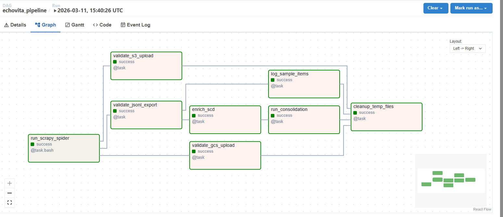
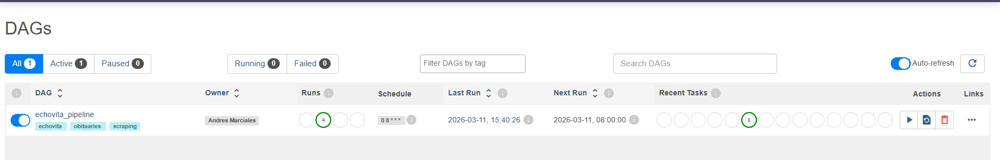
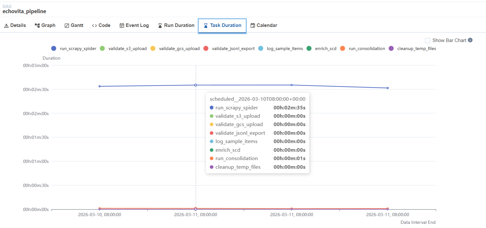
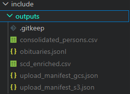

# Technical Report — Echovita Data Integration

## Architecture

```
┌────────────────────────────────────────────────────────────┐
│                    Apache Airflow DAG                      │
│                                                            │
│  ┌──────────────┐    ┌────────────┐    ┌────────────────┐  │
│  │ run_scrapy   │───▶│ validate   │───▶│   enrich_scd  │  │
│  │   _spider    │    │ s3/gcs/    │    │                │  │
│  │ (@task.bash) │    │ jsonl      │    └───────┬────────┘  │
│  └──────────────┘    └────────────┘            │           │
│         │                                      ▼           │
│         │                            ┌──────────────────┐  │
│         │                            │ run_consolidation│  │
│         │                            │    (DuckDB)      │  │
│         │                            └────────┬─────────┘  │
│         │                                     │            │
│         └──────────────────────────┐          │            │
│                                    ▼          ▼            │
│                             ┌──────────────────────┐       │
│                             │  cleanup_temp_files  │       │
│                             └──────────────────────┘       │
└────────────────────────────────────────────────────────────┘
         │
         ▼
┌─────────────────────────────────────────────────────────────┐
│                    Scrapy Project                           │
│                                                             │
│  EchovitaSpider ──▶ MockS3Pipeline (priority 100)           │
│                 ──▶ MockGCSPipeline (priority 200)          │
│                 ──▶ JsonlExportPipeline (priority 300)      │
│                                                             │
│  Outputs: obituaries.jsonl, upload_manifest_s3/gcs.json     │
└─────────────────────────────────────────────────────────────┘
```

All runtime outputs land in `include/outputs/`, which is volume-mounted by the Astro CLI — making files immediately visible on the host without `docker cp`.

---

## Part 1 — Web Scraping

### Spider design

`EchovitaSpider` is a two-stage spider:

1. **Listing pages** (`parse`): extracts detail page URLs via XPath on `a.text-name-obit-in-list`, then yields a request to the next page up to `MAX_PAGES = 5`.
2. **Detail pages** (`parse_obituary_detail`): extracts all fields from the obituary detail page.

**Selector strategy:** rather than targeting generic semantic elements (`article`, `main`), the spider uses the site's specific class identifiers:

| Field | Selector |
|-------|----------|
| Name | `div.obit-main-info-wrapper-min-height p.my-auto::text` |
| Dates | `//p[.//i[contains(@class, "fa-calendar-day")]]/text()` |
| City / State | `//p[.//i[contains(@class, "fa-map-marker-alt")]]/a/text()` |
| Obituary text | `div#obituary p, div.ObituaryDescText p` |

Using `div#obituary` as the container eliminates the need to filter boilerplate paragraphs by prefix matching — the container already scopes the content to the obituary body. The only remaining cleanup needed is stripping inline CTAs embedded within the first `<p>` (e.g., "Family and friends are welcome to send flowers"), handled by the module-level `_INLINE_CTA` regex compiled once at import time.

### Pipeline chain

```
Item
 │
 ├──▶ MockS3Pipeline (100)
 │       process_item: serialise to in-memory dict keyed by URL slug
 │       close_spider: write upload_manifest_s3.json
 │
 ├──▶ MockGCSPipeline (200)
 │       process_item: same pattern
 │       close_spider: write upload_manifest_gcs.json
 │
 └──▶ JsonlExportPipeline (300)
         process_item: accumulate items in spider.jsonl_items
         close_spider: write obituaries.jsonl (overwrite)
```

All three pipelines accept `scrapy.Item` (base class) rather than the concrete `ObituaryItem`. This means adding a new spider with a different item schema requires no changes to the pipeline layer.

`RealS3Pipeline` is implemented but disabled by default. The assessment explicitly does not require real cloud integration, so enabling it by default would introduce an unnecessary external dependency. However, the implementation is complete and production-ready — it uses boto3, handles `BotoCoreError` and `ClientError` explicitly, and follows the same interface as the mock pipelines. The design decision was to keep the real pipeline as a first-class citizen in the codebase rather than a stub, so that transitioning to a live S3 bucket requires only configuration changes, not code changes.

To enable:
1. Uncomment `RealS3Pipeline` in `ITEM_PIPELINES` at priority 150
2. Set `S3_BUCKET_NAME`, `AWS_ACCESS_KEY_ID`, `AWS_SECRET_ACCESS_KEY`, `AWS_DEFAULT_REGION` via environment variables

### Inter-process communication via manifests

The Scrapy spider runs as a bash subprocess inside Airflow (`@task.bash`). Once the subprocess exits, its memory is gone. The manifests written by `close_spider` serve as a simple file-based IPC mechanism: downstream Airflow tasks read them to assert that uploads occurred and contained items.

```python
# MockS3Pipeline.close_spider
manifest = {"count": len(uploaded), "keys": list(uploaded.keys())}
with open(manifest_path, "w") as f:
    json.dump(manifest, f)
```

After validation, `cleanup_temp_files` removes them. The rationale: manifests are coordination artifacts, not pipeline outputs. They exist solely to bridge the subprocess boundary between the spider and Airflow. Keeping them after the run would pollute the output directory with files that carry no value beyond the current execution and would cause false positives on the next run's validation if the spider happened to fail silently (the old manifest would still be there, making `validate_s3_upload` pass against stale data). Deleting them enforces that each run's validation reflects that run's actual output.

### Output path unification

`PROJECT_ROOT` in `settings.py` resolves to `include/outputs/` relative to the project root using `os.path.abspath(__file__)`. The DAG's `SCRAPY_CMD` explicitly passes `-s PROJECT_ROOT=<output_dir>` as a Scrapy setting override, ensuring both local and Airflow runs write to the same mounted volume path.

---

## Part 2 — SCD Consolidation

### Design decision: city and state extraction beyond the requirements

The assessment's Part 2 operates on a provided static CSV (`scd_person_geo_sample.csv`) and does not explicitly require connecting it to the scraping output. However, the geographic data (city, state) is available on each Echovita detail page and is directly relevant to the SCD model described in the requirements — which tracks precisely those fields per person over time.

Extracting `city` and `state` in the spider and feeding them into the SCD table was a deliberate design decision to demonstrate end-to-end pipeline coherence. In a production scenario, each daily scrape would produce new geographic observations for recently deceased individuals. Appending those as open SCD rows (`valid_to = NULL`, `valid_from = today`) is the natural extension of the model — the `enrich_scd` task simulates exactly this pattern.

The source file is never modified. The enrichment produces a separate `scd_enriched.csv` that is overwritten on each run, keeping the source data immutable and the pipeline idempotent.

### Query design

The consolidation runs entirely in DuckDB in-memory. The query uses window functions with three separate `ROW_NUMBER()` partitions to avoid multiple scans:

```sql
WITH ordered AS (
    SELECT
        person_id, city, valid_from,
        ROW_NUMBER() OVER (PARTITION BY person_id ORDER BY valid_from ASC)  AS rn_asc,
        ROW_NUMBER() OVER (PARTITION BY person_id ORDER BY valid_from DESC) AS rn_desc,
        ROW_NUMBER() OVER (
            PARTITION BY person_id
            ORDER BY CASE WHEN city IS NOT NULL THEN 0 ELSE 1 END, valid_from DESC
        ) AS rn_last_non_null
    FROM scd_geo
)
```

- `first_city`: `rn_asc = 1`
- `last_city`: `rn_desc = 1` (may be NULL — intentional)
- `last_non_null_city`: `rn_last_non_null = 1 AND city IS NOT NULL`
- `distinct_cities`: `COUNT(DISTINCT city) FILTER (WHERE city IS NOT NULL)`

`NULLIF(TRIM(city), '')` normalises empty strings and whitespace-only values to `NULL` before aggregation, making the query resilient to inconsistent source data.

### Integration with scraping output

The `enrich_scd` task in the DAG merges the static sample CSV with live scraped data before consolidation runs:

1. Read `data/scd_person_geo_sample.csv` (immutable source — never modified)
2. Read `obituaries.jsonl` scraped in the current run
3. Append each scraped record as an open SCD row: `valid_from = today`, `valid_to = NULL`
4. Write `include/outputs/scd_enriched.csv`
5. `run_consolidation` receives this path via XCom

The source CSV is never mutated. The enriched file is overwritten on each run (idempotent).

---

## Part 3 — Airflow DAG

### Task graph rationale

```python
scrape >> [val_s3, val_gcs, val_jsonl]   # parallel validation after spider
val_jsonl >> [sample, enriched]           # JSONL required for both sampling and SCD enrichment
[val_s3, val_gcs, sample, consolidate] >> cleanup  # cleanup only after all consumers finish
```

`run_consolidation` is a dependency of `cleanup` (not parallel with it) because consolidation consumes `scd_enriched.csv`, which must complete before the pipeline can be considered done. Cleanup is the terminal node.

### Production-readiness criteria

#### Retries

Configured via `DEFAULT_ARGS` applied to all tasks in the DAG:

```python
DEFAULT_ARGS = {
    "retries": 2,
    "retry_delay": timedelta(minutes=2),
}
```

Every task retries up to twice on failure with a 2-minute cooldown between attempts. This covers transient failures such as network timeouts during the spider run or file system race conditions during validation.

#### Logging

Three logging layers are active simultaneously:

- **Scrapy pipelines** — `logging.getLogger(__name__)` at the module level. Each `process_item` call logs the storage key (`INFO`); `close_spider` logs item count and manifest path. Failures in `errback_detail` are logged as `WARNING` with the failed URL.
- **Scrapy spider** — `self.logger` (Scrapy's built-in per-spider logger). Bound to the spider name, so log lines are identifiable by spider in multi-spider projects.
- **Airflow tasks** — `print()` statements inside `@task` functions. Airflow captures stdout from task execution and surfaces it in the task log viewer in the UI. No additional logging setup required in the TaskFlow API.

All logs are visible in the Airflow UI under each task's **Log** tab, regardless of whether the task succeeded or failed.

#### Clear task dependencies

Dependencies are declared explicitly using the `>>` operator in a dedicated block at the bottom of the DAG function, separate from task definitions:

```python
scrape >> [val_s3, val_gcs, val_jsonl]
val_jsonl >> [sample, enriched]
[val_s3, val_gcs, sample, consolidate] >> cleanup
```

This separation — define tasks, then wire them — makes the dependency graph readable as a standalone declaration. The Airflow UI renders it as the visual graph shown in `images/dag_graph.png`.

#### Idempotent behavior

Idempotency is enforced at every write point in the pipeline:

| Output | Guarantee |
|--------|-----------|
| `obituaries.jsonl` | Opened with `"w"` — overwritten on every run |
| `upload_manifest_s3/gcs.json` | Opened with `"w"` — overwritten, then deleted by cleanup |
| `scd_enriched.csv` | Rebuilt from immutable source CSV + current JSONL on every run |
| `consolidated_persons.csv` | `out.unlink()` called before DuckDB `COPY TO` to avoid permission errors on overwrite |

Re-running the full pipeline any number of times on the same day produces identical output files, with no accumulated state between runs.

### DAG documentation

The DAG uses `doc_md=__doc__` to expose its module-level docstring in the Airflow UI under the **Docs** tab. The docstring is formatted as Markdown and includes the full task graph and a per-task description table, making the pipeline self-documenting within the orchestration layer.

### Scheduler configuration

```python
schedule="0 8 * * *"    # daily at 08:00 UTC
start_date=datetime(2025, 1, 1)
catchup=False           # no backfill on first deploy
```

---

## Extensibility

The project is designed so that adding a new data source (e.g., a second obituary site) requires changes in exactly two places:

1. **`echovita_scraper/spiders/`** — add a new spider file
2. **`echovita_scraper/items.py`** — add a new `scrapy.Item` subclass if the schema differs

The pipeline chain (MockS3, MockGCS, JSONL export) handles any `scrapy.Item` automatically. The `enrich_scd` task in the DAG looks for `city`, `state`, and `full_name` keys in the JSONL — a new source that shares these fields integrates with the SCD model at no additional cost.

---

## Pipeline screenshots

### DAG graph view


### DAG overview


### Task duration breakdown


### Pipeline output files


---

## Project Structure

```
echovita_project/
├── dags/
│   └── echovita_pipeline_dag.py   # Airflow DAG (TaskFlow API)
├── echovita_scraper/              # Scrapy project
│   ├── spiders/echovita_spider.py
│   ├── pipelines.py               # MockS3, MockGCS, RealS3 (opt-in), JSONL
│   ├── items.py
│   └── settings.py
├── scripts/
│   └── consolidate_scd.py         # DuckDB SCD consolidation
├── data/
│   └── scd_person_geo_sample.csv  # Source SCD data (immutable)
├── samples/                       # Representative outputs from an actual run
│   ├── obituaries_sample.jsonl
│   └── consolidated_persons_sample.csv
├── include/outputs/               # Runtime outputs (volume-mounted, gitignored)
├── docs/
│   ├── images/                    # Airflow UI screenshots
│   │   ├── dag_graph.png
│   │   ├── dag_view.png
│   │   └── tasks_duration_view.png
│   └── airflow_logs/              # Task logs from a representative run
│       ├── run_scrapy_spider.log
│       ├── validate_s3_upload.log
│       ├── validate_gcs_upload.log
│       ├── validate_jsonl_export.log
│       ├── log_sample_items.log
│       ├── enrich_scd.log
│       ├── run_consolidation.log
│       └── cleanup_temp_files.log
├── tests/
│   └── test_dag_echovita.py
├── Dockerfile
├── requirements.txt
└── README.md
```

---

## Dependencies

```
Scrapy>=2.11.0,<3.0
duckdb>=0.9.0,<1.0
boto3>=1.34.0,<2.0      # RealS3Pipeline (opt-in)
pytest>=7.0.0
```

Runtime environment: Python 3.12, Astronomer Runtime 13.5.1 (Airflow 2.x base).
